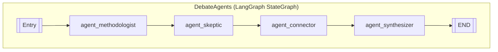

# Debate Workflow (LangGraph StateGraph)

## Overview
The **Debate Workflow** is a multi-agent pipeline powered by **LangGraph** that evaluates and synthesizes scientific claims using specialized "personas". It runs as a serial chain on Apple Silicon (M4) using a single loaded LLM (Phi-3.5-mini-instruct 4-bit via MLX-LM).

---

## Architecture Diagram



---

## Agent Roles

| Agent | Purpose |
|-------|---------|
| **Methodologist** | Assess study rigor, sample size, and statistical power. Detects p-hacking risks. |
| **Skeptic** | Find logical gaps, alternative explanations, and methodological flaws. |
| **Connector** | Discover cross-domain analogies, historical precedents, and conceptual bridges. |
| **Synthesizer** | Integrate debate history and produce a verdict with confidence score. |

---

## State Schema

```python
class DebateState(TypedDict):
    claim_a: str           # First claim to evaluate
    claim_b: str           # Second claim (if comparative)
    debate_history: List[str]  # Log of agent outputs
    verdict: str           # supports | refutes | extends | orthogonal
    confidence: float      # 0.0 – 1.0
    explanation: str       # Final synthesis rationale
```

---

## Execution Flow

1. **Input**: Two claims (`claim_a`, `claim_b`) and an empty `debate_history`.
2. **Methodologist** analyzes for methodology red-flags and appends output to history.
3. **Skeptic** critiques the claims and appends output.
4. **Connector** finds analogies and appends output.
5. **Synthesizer** reads history, outputs JSON with `verdict`, `confidence`, `explanation`.
6. **Output**: Final state with populated verdict and log.

---

## File Reference

- **Source**: [`jarvis_m4/services/debate.py`](file:///Users/ishaanmajumdar/Desktop/Jrvis/jarvis_m4/services/debate.py)
- **Entry Point**: `DebateAgents.run_debate(claim_a, claim_b)`

---

## Invocation Example

```python
from jarvis_m4.services.debate import DebateAgents

debater = DebateAgents()
result = debater.run_debate(
    claim_a="Attention mechanisms improve NLP accuracy",
    claim_b="RNNs are sufficient for NLP tasks"
)
print(result)
# {'verdict': 'extends', 'confidence': 0.78, ...}
```
