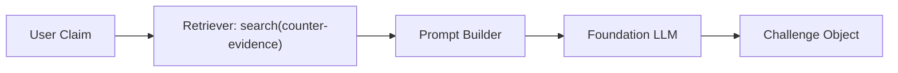

# Doubt Mode Workflow

## Overview
**DoubtEngine** is a devil's advocate mode that challenges user claims with counter-evidence from the knowledge base, forcing rigorous thinking.

---

## Strength Levels

| Level | Behavior |
|-------|----------|
| `GENTLE` | Soft challenges, alternative perspectives |
| `MODERATE` | Direct objections with sources |
| `HARSH` | Aggressive challenge of all claims |

---

## Pipeline Diagram



---

## Output Format

```
⚠️ Challenge: [specific objection]
📄 Source: [brief citation]
❓ Question: [clarifying question]
```

---

## Usage Example

```python
from research_os.features import DoubtEngine
from research_os.foundation.core import foundation
from research_os.search.retriever import get_retriever

doubt = DoubtEngine(foundation, retriever=get_retriever())
doubt.toggle()  # Enable
doubt.set_strength(DoubtStrength.MODERATE)

response = await doubt.respond("Transformers are always better than RNNs")
print(response)
```

---

## File Reference

- [`research_os/features/doubt.py`](file:///Users/ishaanmajumdar/Desktop/Jrvis/research_os/features/doubt.py)
