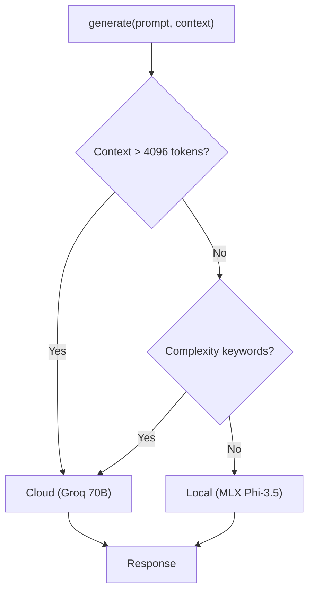

# Hybrid Generation Workflow (Foundation)

## Overview
The **Foundation** core layer provides a **smart routing** generation engine that selects between:

- **Local (MLX)**: Fast, private inference on Apple Silicon (Phi-3.5-mini / Qwen2.5-7B).
- **Cloud (Groq)**: High-capacity 70B model for complex reasoning or large contexts.

---

## Routing Decision Diagram



---

## Routing Criteria

| Condition | Routes To |
|-----------|-----------|
| `use_cloud=True` (forced) | Cloud (Groq) |
| Estimated tokens > `CLOUD_BURST_THRESHOLD` (4096) | Cloud |
| Keywords: `compare`, `analyze`, `synthesize`, `across`, `multiple papers` | Cloud |
| Otherwise | Local (MLX) |

---

## Usage Example

```python
from research_os.foundation.core import foundation

# Sync generation
response = foundation.generate(
    prompt="Summarize the attention mechanism",
    context=retrieved_context,
    use_cloud=False  # auto-route
)

# Async streaming
async for token in foundation.generate_stream_async(
    prompt="Explain transformers",
    callback=lambda t: print(t, end="", flush=True)
):
    pass
```

---

## File Reference

- **Foundation Core**: [`research_os/foundation/core.py`](file:///Users/ishaanmajumdar/Desktop/Jrvis/research_os/foundation/core.py)
- **Router**: [`research_os/foundation/router.py`](file:///Users/ishaanmajumdar/Desktop/Jrvis/research_os/foundation/router.py)
