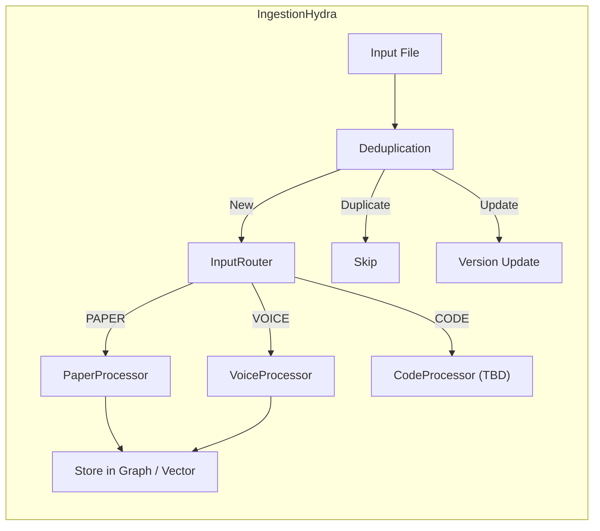

# Ingestion Workflow (Hydra)

## Overview
The **IngestionHydra** is an asynchronous parallel ingestion engine that routes incoming files to type-specific processors. It handles massive file streams by spawning concurrent processing tasks.

---

## Architecture Diagram



---

## Route Types

| ResearchType | Extensions / Patterns | Processor |
|--------------|----------------------|-----------|
| `PAPER` | `.pdf`, `.docx` | `paper_processor` (marker-pdf + chunking) |
| `VOICE` | `.wav`, `.mp3`, `.m4a` | `voice_processor` (Whisper transcription) |
| `CODE` | `.py`, `.js`, `.ts`, etc. | (Not yet implemented) |

---

## Execution Flow

1. **Input**: File path or directory.
2. **Deduplication**: Checks file hash, DOI, and arXiv version.
   - If exact duplicate: Skips.
   - If newer version (arXiv v1 → v2): Updates record.
3. **Router** inspects file extension and returns `ResearchType`.
3. **Processor** runs in a thread executor (`asyncio.to_thread`) to avoid blocking.
4. **Output**: Processed document object ready for indexing.

---

## Usage Example

```python
from research_os.ingestion.hydra import hydra

# Ingest single file
result = await hydra.ingest_file("/path/to/paper.pdf")

# Ingest entire directory (parallel)
results = await hydra.ingest_directory("/path/to/papers/")
```

---

## File References

- **Hydra**: [`research_os/ingestion/hydra.py`](file:///Users/ishaanmajumdar/Desktop/Jrvis/research_os/ingestion/hydra.py)
- **Router**: [`research_os/ingestion/router.py`](file:///Users/ishaanmajumdar/Desktop/Jrvis/research_os/ingestion/router.py)
- **Paper Processor**: [`research_os/ingestion/processors/paper.py`](file:///Users/ishaanmajumdar/Desktop/Jrvis/research_os/ingestion/processors/paper.py)
- **Voice Processor**: [`research_os/ingestion/processors/voice.py`](file:///Users/ishaanmajumdar/Desktop/Jrvis/research_os/ingestion/processors/voice.py)
