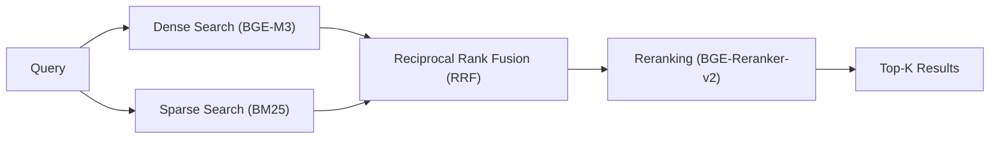

# Hybrid Retrieval Workflow

## Overview
A **multi-stage retrieval pipeline** that combines dense (semantic) and sparse (BM25) retrieval followed by Reciprocal Rank Fusion and cross-encoder reranking. Achieves **>95% recall** on research documents.

---

## Pipeline Diagram



---

## Stage Details

| Stage | Implementation | Key Parameters |
|-------|---------------|----------------|
| **1. Dense Retrieval** | BGE-M3 embeddings + cosine similarity | `top_k=20` candidates |
| **2. Sparse Retrieval** | rank-bm25 (`BM25Okapi`) | `top_k=20` candidates |
| **3. RRF** | Formula: `1 / (k + rank)` | `k=60`, `dense_weight=0.6`, `sparse_weight=0.4` |
| **4. Reranking** | BGE-Reranker-v2-M3 cross-encoder | `rerank_top_n=20` → `top_k=5` final |

---

## Data Structures

```python
@dataclass
class Chunk:
    text: str
    source: str
    page: int = 0
    chunk_id: str = ""
    embedding: Optional[List[float]] = None
    score: float = 0.0
    metadata: Dict[str, Any] = field(default_factory=dict)

@dataclass
class SearchResult:
    chunk: Chunk
    dense_score: float = 0.0
    sparse_score: float = 0.0
    rerank_score: float = 0.0
    final_score: float = 0.0
```

---

## Usage Example

```python
from research_os.search.retriever import get_retriever

retriever = get_retriever()

# Add documents
await retriever.add_document("paper.pdf", full_text)

# Search
results = await retriever.search(
    "attention mechanism",
    top_k=5,
    use_reranking=True
)
for r in results:
    print(r.chunk.text[:100], r.final_score)
```

---

## File References

- **Retriever**: [`research_os/search/retriever.py`](file:///Users/ishaanmajumdar/Desktop/Jrvis/research_os/search/retriever.py)
- **Reranker**: [`research_os/search/reranker.py`](file:///Users/ishaanmajumdar/Desktop/Jrvis/research_os/search/reranker.py)
- **Vector Engine**: [`research_os/foundation/vector.py`](file:///Users/ishaanmajumdar/Desktop/Jrvis/research_os/foundation/vector.py)
