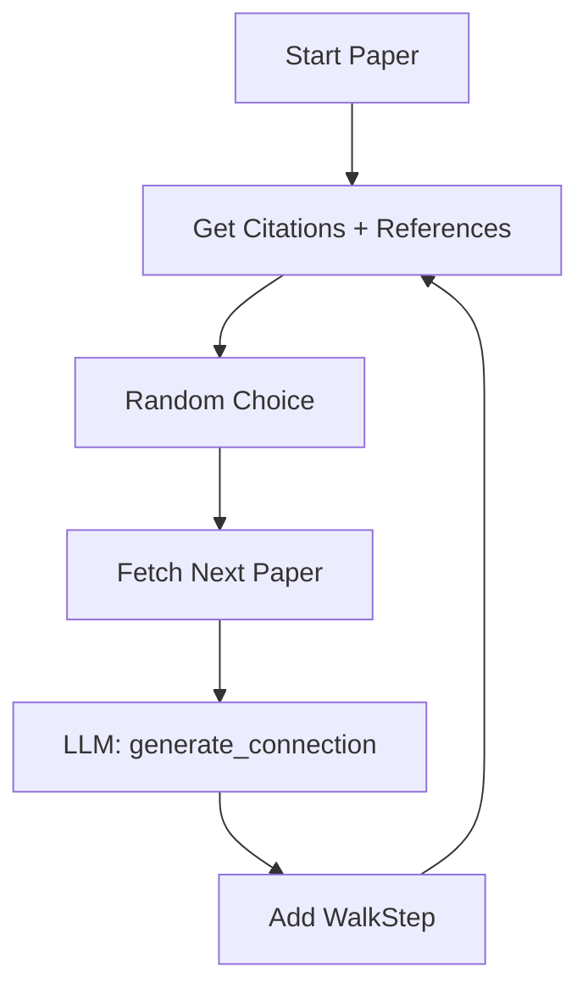

# Serendipity Walk Workflow

## Overview
**SerendipityEngine** performs random walks through the citation graph for unexpected discoveries — like StumbleUpon for research papers.

---

## Walk Types

| Type | Description |
|------|-------------|
| `CITATION` | Follow citation/reference paths |
| `AUTHOR` | Papers by same authors (TBD) |
| `TOPIC` | Semantically similar papers (TBD) |
| `RANDOM` | Daily random paper from topics |

---

## Pipeline Diagram



---

## Data Structures

```python
@dataclass
class WalkStep:
    paper_id: str
    title: str
    connection_story: str  # AI-generated narrative
    walk_type: WalkType

@dataclass
class SerendipityWalk:
    steps: List[WalkStep]
    start_paper: str
    created_at: datetime
```

---

## Usage Example

```python
from research_os.features import SerendipityEngine
from research_os.foundation.core import foundation

serendipity = SerendipityEngine(foundation)

walk = await serendipity.walk_from_paper("649def34f8be52c8b66281af98ae884c09aef38b", steps=5)
print(walk.to_narrative())
```

---

## File Reference

- [`research_os/features/serendipity.py`](file:///Users/ishaanmajumdar/Desktop/Jrvis/research_os/features/serendipity.py)
