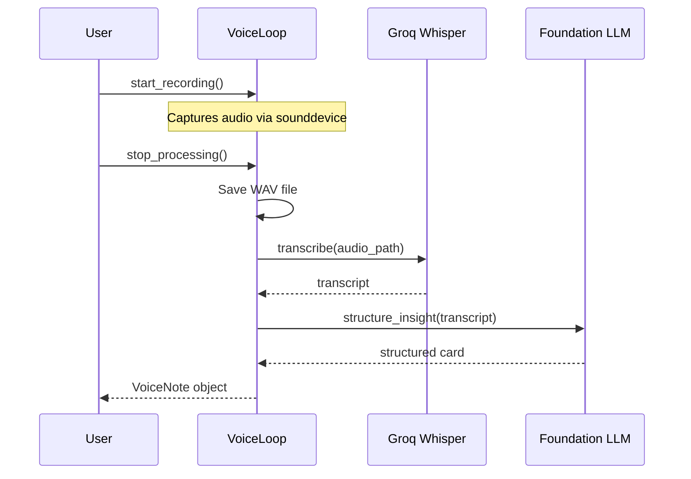

# Voice Loop Workflow

## Overview
The **VoiceLoop** captures spoken research insights via push-to-talk, transcribes them using Groq Whisper, and structures them into actionable insight cards using the hybrid intelligence engine.

---

## Pipeline Diagram



---

## Data Structure

```python
@dataclass
class VoiceNote:
    transcript: str           # Raw transcription text
    structured_content: str   # Markdown insight card
    created_at: datetime
    audio_path: str           # Path to saved WAV file
```

---

## Insight Card Format

```
# 🎙️ Insight: [One sentence summary]
- **Core Idea**: [What is the main point?]
- **Context/Connection**: [How does this relate to broader research?]
- **Action**: [What should I do next?]
```

---

## Usage Example

```python
from research_os.features import VoiceLoop
from research_os.foundation.core import foundation

voice = VoiceLoop(foundation)

# Start push-to-talk
voice.start_recording()

# ... user speaks ...

# Stop and process
note = await voice.stop_processing()
print(note.structured_content)
```

---

## File Reference

- **VoiceLoop**: [`research_os/features/voice.py`](file:///Users/ishaanmajumdar/Desktop/Jrvis/research_os/features/voice.py)
