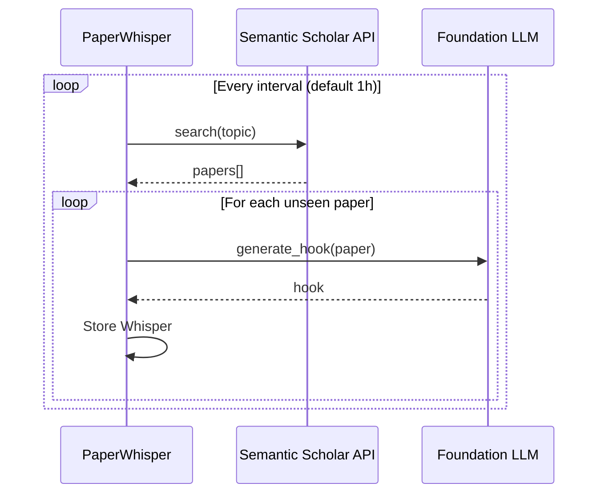

# Paper Whispers Workflow

## Overview
**PaperWhisper** is a background monitoring system that:
1. Polls **Semantic Scholar** for new papers matching user-defined topics.
2. Generates AI **"relevance hooks"** summarizing why each paper matters.
3. Surfaces notifications as ambient whispers.

---

## Pipeline Diagram



---

## Data Structures

```python
@dataclass
class Paper:
    paper_id: str
    title: str
    abstract: str
    authors: List[str]
    year: int
    url: str
    citation_count: int = 0

@dataclass
class Whisper:
    paper: Paper
    hook: str           # AI-generated relevance sentence
    topic: str
    timestamp: datetime
    dismissed: bool = False
```

---

## Usage Example

```python
from research_os.features import PaperWhisper
from research_os.foundation.core import foundation

whisper = PaperWhisper(foundation)
whisper.set_topics(["attention mechanism", "graph neural networks"])

# Start background monitoring
await whisper.start_monitoring(interval_seconds=3600)

# Get recent notifications
for w in whisper.get_recent(5):
    print(w.hook)
```

---

## File Reference

- [`research_os/features/whispers.py`](file:///Users/ishaanmajumdar/Desktop/Jrvis/research_os/features/whispers.py)
